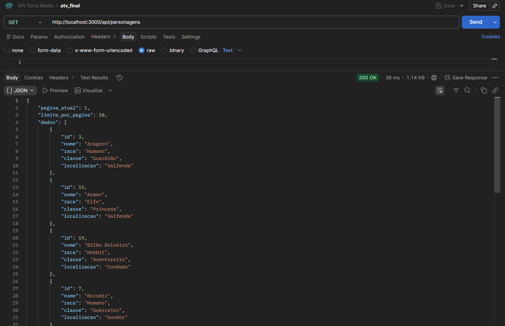

# API Terra-Média - Projeto Final

---

## 1. Descrição do Projeto
Esta API foi desenvolvida como projeto final para consolidar os conceitos de operações CRUD, persistência de dados relacional e manipulação de fluxos de dados (paginação e filtros). O tema escolhido foi a franquia **O Senhor dos Anéis**, gerenciando os heróis e vilões da Terra-Média.

### Requisitos da Aula 08 Atendidos:
* **Persistência Real:** Uso do SQLite3 para salvar dados em arquivo físico (`terra_media.db`).
* **CRUD Completo:** Implementação de todas as rotas (GET, POST, PUT, DELETE).
* **Busca Avançada:** Suporte a filtros por raça, ordenação alfabética e paginação de resultados.
* **Mínimo de Registros:** O sistema inicia automaticamente com 20 registros para teste.

---

## 📡 2. Documentação dos Endpoints

| Funcionalidade | Método | Endpoint | Parâmetros (Query) | Status Sucesso |
| :--- | :--- | :--- | :--- | :--- |
| **Listar/Filtrar** | `GET` | `/api/personagens` | `raca`, `ordem`, `pagina`, `limite` | `200 OK` |
| **Criar Novo** | `POST` | `/api/personagens` | - | `201 Created` |
| **Atualizar** | `PUT` | `/api/personagens/:id` | - | `200 OK` |
| **Remover** | `DELETE` | `/api/personagens/:id` | - | `204 No Content` |

---

## 3. Recursos Implementados

### Listagem Inteligente (Filtros e Paginação)
A rota `GET /api/personagens` aceita os seguintes parâmetros opcionais:
* `raca`: Filtra por raça (ex: `?raca=Elfo`).
* `ordem`: Define a ordem alfabética (`asc` ou `desc`).
* `pagina` e `limite`: Controla a paginação (ex: `?pagina=2&limite=5`).

### Validações Robustas
* Verificação de campos obrigatórios no **POST** e **PUT**.
* Verificação de comprimento mínimo para o nome (mín. 3 caracteres).
* Tratamento de **ID inexistente (404)** em rotas de atualização e exclusão.

### Persistência com SQLite
Diferente de versões anteriores, os dados agora são persistentes. Mesmo que o servidor seja reiniciado, as alterações feitas via POST, PUT ou DELETE permanecem salvas no arquivo de banco de dados.

---

## 4. Tabela de Status Codes

| Código | Descrição | Uso na API |
| :--- | :--- | :--- |
| **200 OK** | Sucesso | Retorno de listagem ou atualização. |
| **201 Created** | Criado | Sucesso ao inserir novo personagem. |
| **204 No Content** | Sem Conteúdo | Sucesso ao deletar (sem corpo de resposta). |
| **400 Bad Request** | Erro do Cliente | Falha em validações de campos obrigatórios. |
| **404 Not Found** | Não Encontrado | ID informado não existe no banco de dados. |
| **500 Internal Error** | Erro de Banco | Falha na conexão ou execução do SQLite. |

---

## 5. Como Executar

1.  **Instalar dependências:**
    ```bash
    npm install
    ```
2.  **Iniciar o projeto (Modo Dev):**
    ```bash
    npm run dev
    ```
    *O banco `terra_media.db` será criado e populado automaticamente na primeira execução.*

---

## 6. Evidências de Teste (Postman)

### Listagem com Paginação (IDs 1 a 20)


### Cadastro de Personagem (POST)


### Filtro por Raça

