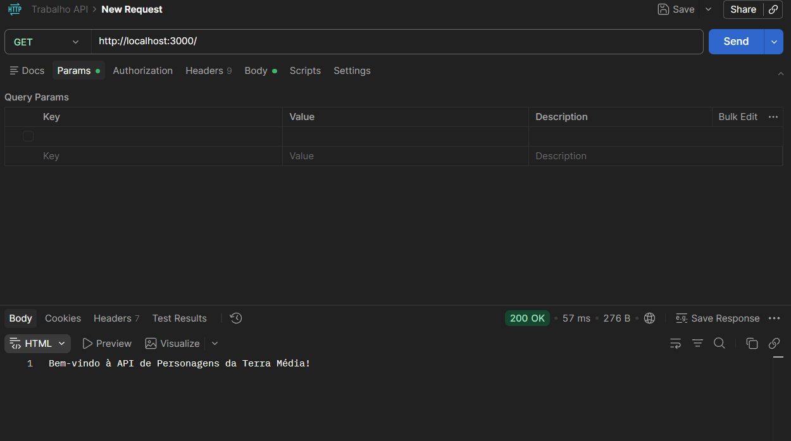
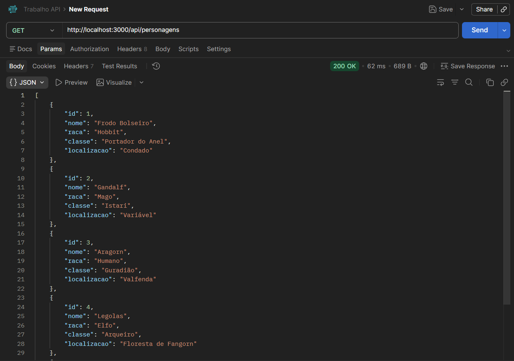
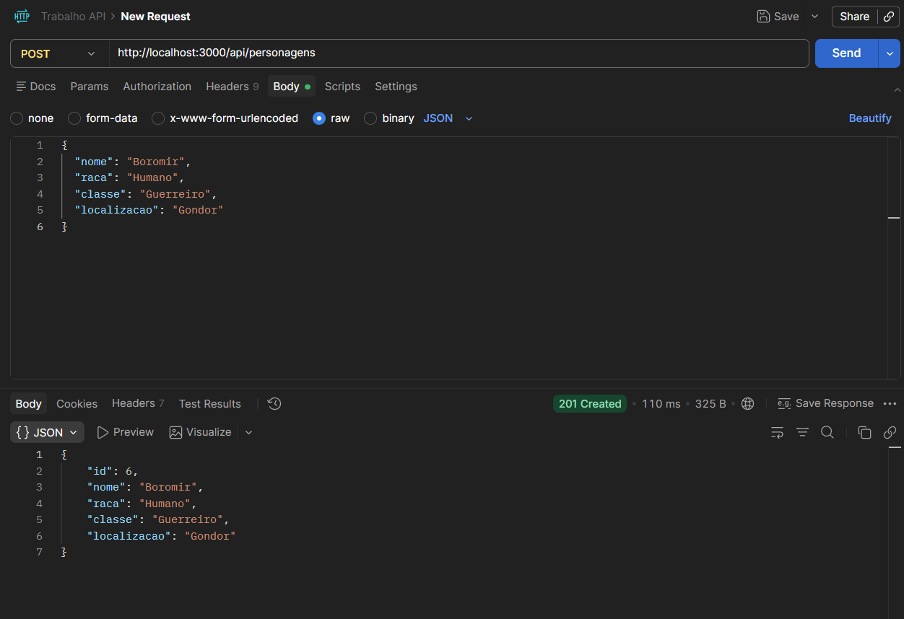
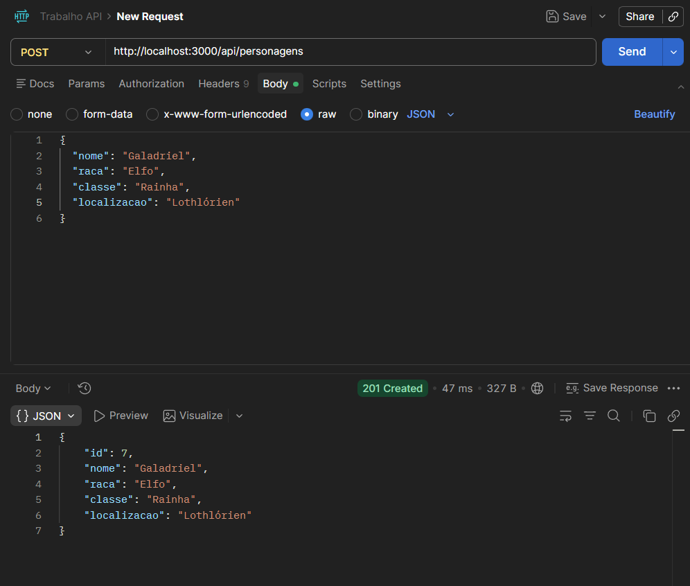
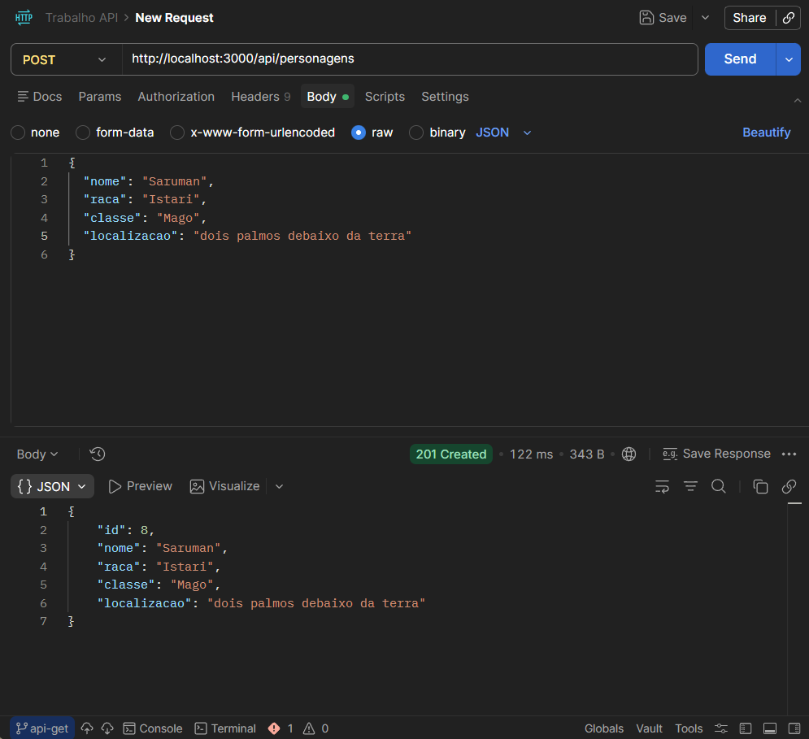
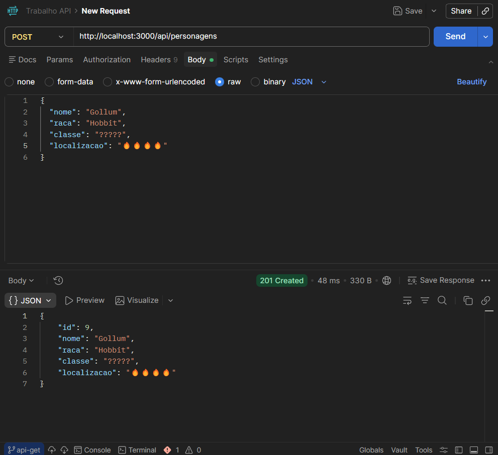
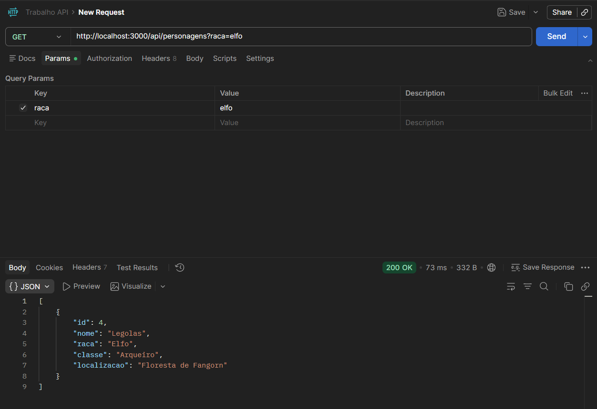

# API da Terra-Média - O Senhor dos Anéis  
**Projeto:** Trabalho 1 - Implementação de Endpoints e Validações  

---

##  1. Lista de Todos os Endpoints
A API permite gerenciar os integrantes da Sociedade do Anel e outros personagens da franquia.

| Funcionalidade | Método | URL | Descrição |
| :--- | :--- | :--- | :--- |
| Boas-vindas | `GET` | `/` | Retorna uma mensagem inicial da API. |
| Listar/Filtrar | `GET` | `/api/personagens` | Lista todos os personagens ou filtra por raça. |
| Criar Novo | `POST` | `/api/personagens` | Adiciona um novo personagem com validações. |

---

##  2. Detalhamento dos Endpoints

###  GET `/`
* **Método:** `GET`
* **URL:** `http://localhost:3000/`
* **Resposta (200 OK):**
```text
Bem-vindo à API de Personagens da Terra Média!
```


### 🟢 GET `/`
* **Método:** `GET`
* **URL:** `http://localhost:3000/api/personagens`
* **Resposta (200 OK):**
```text
[
  { "id": 1, "nome": "Frodo Bolseiro", "raca": "Hobbit", "classe": "Portador do Anel", "localizacao": "Condado" },
  { "id": 2, "nome": "Gandalf", "raca": "Mago", "classe": "Istari", "localizacao": "Variável" },
  { "id": 3, "nome": "Aragorn", "raca": "Humano", "classe": "Guradião", "localizacao": "Valfenda" },
  { "id": 4, "nome": "Legolas", "raca": "Elfo", "classe": "Arqueiro", "localizacao": "Floresta de Fangorn" },
  {id: 5, nome: "Gimli", raca: "Anão", classe: "Guerreiro", localizacao: "Moria"}
]
```


###  POST `/api/personagens`
* **Método:** `POST`
* **URL:** `http://localhost:3000/api/personagens`
* **Corpo da Requisição (Body JSON):**
```json
{
  "nome": "Boromir",
  "raca": "Humano",
  "classe": "Guerreiro",
  "localizacao": "Gondor"
}
```
* **Resposta (201 Created):**
```json
{
  "id": 6,
  "nome": "Boromir",
  "raca": "Humano",
  "classe": "Guerreiro",
  "localizacao": "Gondor"
}
```


###  POST `/api/personagens`
* **Método:** `POST`
* **URL:** `http://localhost:3000/api/personagens`
* **Corpo da Requisição (Body JSON):**
```json
{
  "nome": "Galadriel",
  "raca": "Elfo",
  "classe": "Rainha",
  "localizacao": "Lothlórien"
}
```
* **Resposta (201 Created):**
```json
{
  "id": 7,
  "nome": "Galadriel",
  "raca": "Elfo",
  "classe": "Rainha",
  "localizacao": "Lothlórien"
}
```


###  POST `/api/personagens`
* **Método:** `POST`
* **URL:** `http://localhost:3000/api/personagens`
* **Corpo da Requisição (Body JSON):**
```json
{
  "nome": "Saruman",
  "raca": "Istari",
  "classe": "Mago",
  "localizacao": "dois palmos debaixo da terra"
}
```
* **Resposta (201 Created):**
```json
{
  "id": 8,
  "nome": "Saruman",
  "raca": "Istari",
  "classe": "Mago",
  "localizacao": "dois palmos debaixo da terra"
}
```


###  POST `/api/personagens`
* **Método:** `POST`
* **URL:** `http://localhost:3000/api/personagens`
* **Corpo da Requisição (Body JSON):**
```json
{
  "nome": "Gollum",
  "raca": "Hobbit",
  "classe": "?????",
  "localizacao": "🔥🔥🔥🔥🔥"
}
```
* **Resposta (201 Created):**
```json
{
  "id": 9,
  "nome": "Gollum",
  "raca": "Hobbit",
  "classe": "?????",
  "localizacao": "🔥🔥🔥🔥🔥"
}
```


###  POST `/api/personagens`
* **Método:** `POST`
* **URL:** `http://localhost:3000/api/personagens`
* **Corpo da Requisição (Body JSON):**
```text
{
  "nome": "Sam",
  "raca": "Hobbit",
  "classe": "Pai de familia",
  "localizacao": "Condado"
}
```
* **Resposta (201 Created):**
```json
{
  "id": 10,
  "nome": "Sam",
  "raca": "Hobbit",
  "classe": "Pai de familia",
  "localizacao": "Condado"
}
```


### Filtro por Raça


## 3. Explicação de Validações Implementadas
A API permite gerenciar os integrantes da Sociedade do Anel e outros personagens da franquia.
1. Campos Obrigatórios: O servidor verifica se nome, raca e classe foram enviados no corpo da requisição. Caso algum campo esteja ausente, o sistema retorna Status 400 (Bad Request).
2. Consistência do Nome: Foi implementada uma trava onde o campo nome deve possuir no mínimo 3 caracteres. Nomes menores são rejeitados.
3. Localização Padrão (Default): Caso a localizacao não seja informada no JSON enviado, a API define automaticamente como "Terra-Média".
4. Gerenciamento de Identificadores (ID): O servidor controla a geração de IDs de forma incremental (iniciando em 6 para novos recursos), garantindo que cada personagem tenha um ID único.

## ⚙️ Como Rodar o Projeto
1. Clone este repositório.
2. No terminal, execute `npm install` para baixar as dependências.
3. Inicie o servidor com `npm run dev`.
4. A API estará disponível em: `http://localhost:3000`
